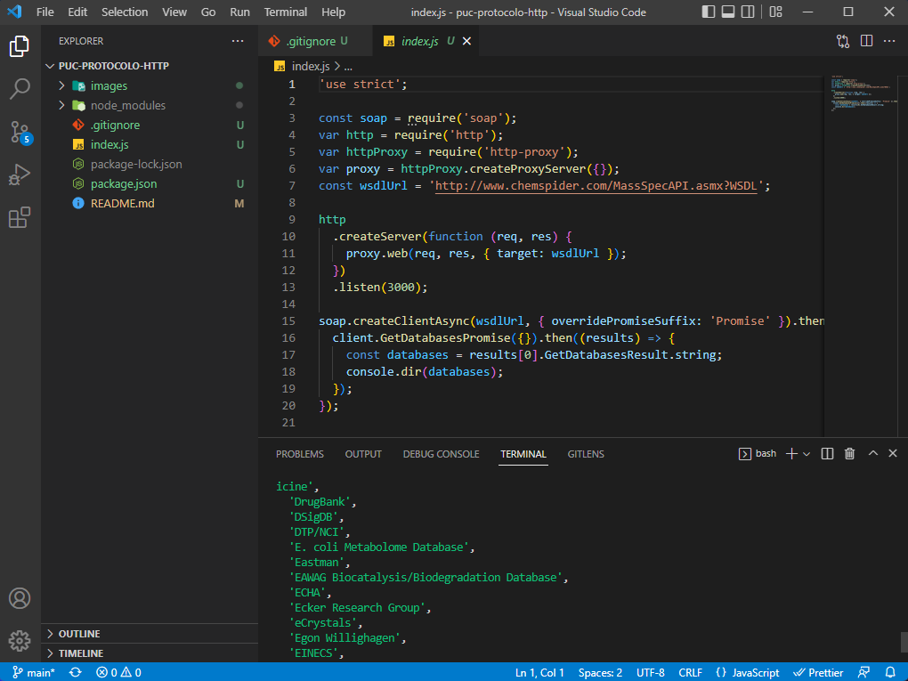

## Pontifícia Universidade Católica de Minas Gerais

| Atividade 01   | Protocolo HTTP            |
| -------------- | ------------------------- |
| Especialização | Arquitetura de Soluções   |
| Disciplina     | APIs e Web Services (AWS) |
| Professor      | Vinicius Amaral           |
| Aluno          | Thales Terra              |
| Código Pessoa  | 1332205                   |

